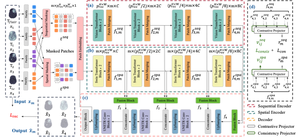

# A Unified Missing Modality Imputation Model with Inter-Modality Contrastive and Consistent Learning
[[Paper]](https://papers.miccai.org/miccai-2025/paper/1980_paper.pdf) 

<figure>
 
 <figcaption><em>Overview of our framework.</em></figcaption>
</figure>

This is the Pytorch implement of our paper "A Unified Missing Modality Imputation Model with Inter-Modality Contrastive and Consistent Learning". It includes all materials necessary to reproduce our framework.

---
## Required Dependencies
- Python 3.7+
- PyTorch 1.8+
- torchvision
- numpy
- matplotlib
- monai

---
## Data
We use [split_brats_2d.py](./split_brats_2d.py) to build a 2D dataset from the BraTS 2023 dataset (Task 1) for training our model. The directory structure of BraTS 2023 should be as follows, and the TrainingData path should be passed to the [split_brats_2d.py](./split_brats_2d.py) script:


\-- BraTS 2023

\----- Adult_Glioma

\---------- TrainingData

\---------- ValidationData


---
## Training
Our experiments use a single 80G A100 gpu.
```bash
python ./run.py 
```
---
## 错误更正
1. Table 1 缺少使用 T1 与 Tf 的情况，实验结果如下：

|  PSNR |       |       |       |  SSIM |       |       |       |
|:-----:|-------|-------|-------|:-----:|-------|-------|-------|
| Zhang |  MMT  | Ours* |  Ours | Zhang |  MMT  | Ours* |  Ours |
| 27.80 | 28.88 | 28.01 | 29.26 | 0.776 | 0.761 | 0.812 | 0.828 |

2. Table 2 缺少使用 T1 与 Tf 模态的分割结果，在只缺少 T1c 模态时 ET 区域分割结果错误更正，Baseline 结果数字格式修正，修正内容如下：
   
| Modality     | WT    |      |       |      | TC    |      |       |      | ET    |       |       |       |
|--------------|-------|------|-------|------|-------|------|-------|------|-------|-------|-------|-------|
| T1,T2,T1c,Tf | MMT   | M3   | Ours* | Ours | MMT   | M3   | Ours* | Ours | MMT   | M3    | Ours* | Ours  |
| 1001         | 80.2  | 81.3 | 82.4  | 84.9 | 71.2  | 72.1 | 75.8  | 77.3 | 65.3  | 65.2  | 69.8  | 70.7  |
| 1101         |       |      |       |      |       |      |       |      | 78.97 | 78.53 | 82.11 | 84.12 |
| Baseline     | 93.80 |      |       |      | 92.37 |      |       |      | 86.92 |       |       |       |

---
# Citation
If you find this repository useful, please consider citing our paper:
```bash
@inproceedings{qi2025unified,
  title={A Unified Missing Modality Imputation Model with Inter-modality Contrastive and Consistent Learning},
  author={Qi, Liangce and Liu, Yusi and Li, Yuqin and Shi, Weili and Feng, Guanyuan and Jiang, Zhengang},
  booktitle={International Conference on Medical Image Computing and Computer-Assisted Intervention},
  pages={44--53},
  year={2025},
  organization={Springer}
}
```
